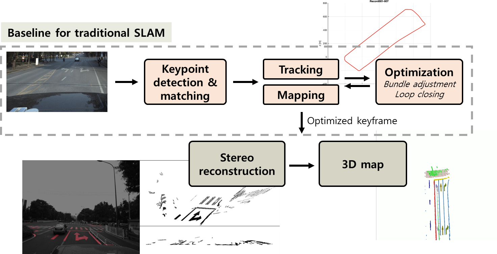

# rm_mapping
Road mark mapping with baseline framework of [ORB_SLAM2](https://github.com/raulmur/ORB_SLAM2)

## Architecture


## Result
<p align="center"></p>

## Install OpenCV 3.4.4
```
chmod a+x opencv-3.4.4_install.sh
./opencv-3.4.4_install.sh
```

## Install Pangolin
We use [Pangolin](https://github.com/stevenlovegrove/Pangolin) for visualization same as [ORB_SLAM2](https://github.com/raulmur/ORB_SLAM2). We recommand Pangolin version 0.5 for build issue.

## Build
```
chmod a+x build.sh
./build.sh
```

## Download dataset
Dataset can be downloaded at: [ApolloScape](http://apolloscape.auto/lane_segmentation.html)

## Run monocular example
```
./examples/mono_apollo examples/APOLLO.yaml <path_to_sequence> <start_record_number>
```
**<path_to_sequence>** should end with `.../ColorImage_road02/ColorImage/`
**<start_record_number>** should be one of following: `1`, `15` and `18` for Road02.

todo: find <start_record_number> for Road03 and Road04
